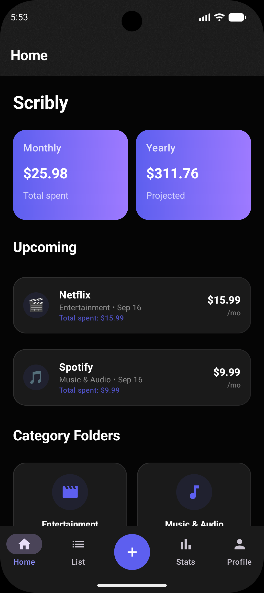
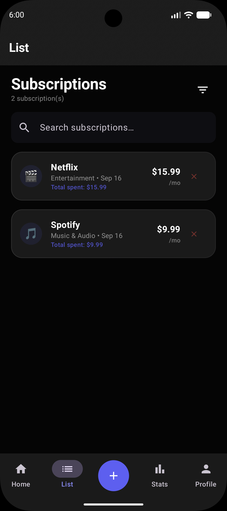
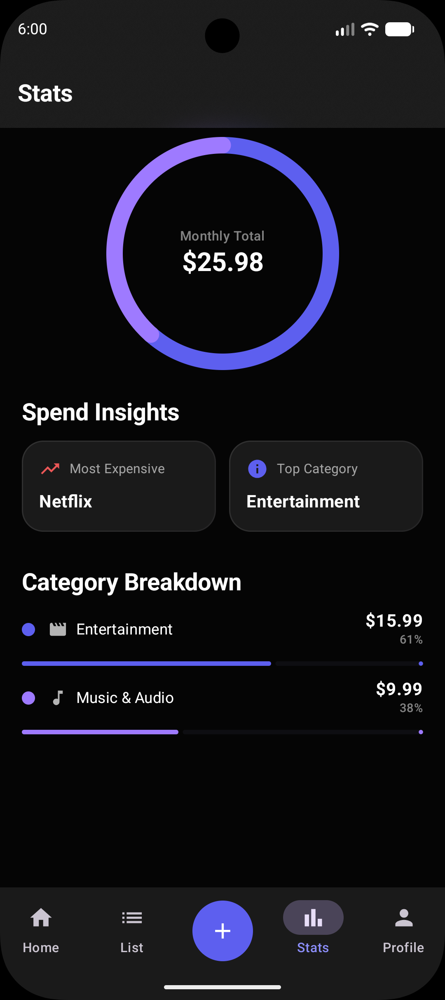
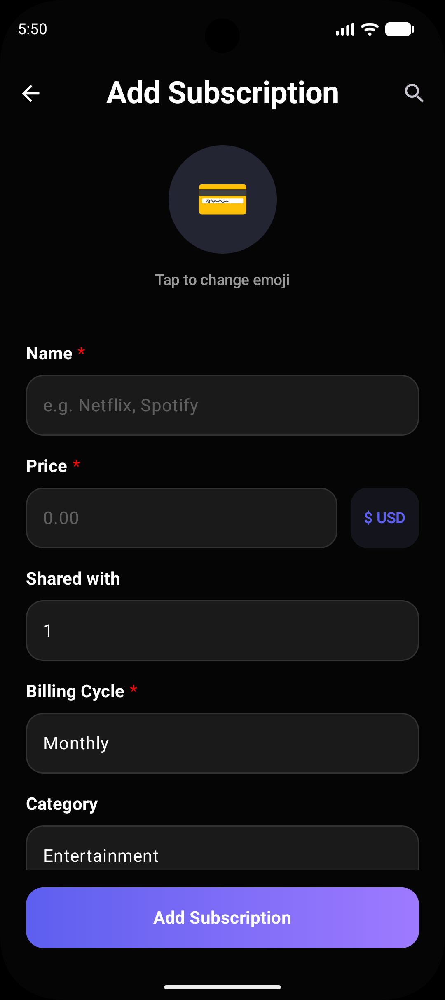

# Scribly Android
## A premium, native Android application for tracking your subscriptions.

### Introduction

Scribly is a clean, native Android implementation of a subscription tracker. It was built using modern Android development practices and is designed to help you take control of your recurring expenses, manage shared subscriptions, and understand your long-term spending habits.

I created this project to explore the latest capabilities of the Android ecosystem—including Jetpack Compose and Glance—and to provide a high-fidelity, ad-free financial tool.

**Note:** I am a hobbyist developer and this project is a work in progress. While I strive for a stable experience, you may encounter occasional bugs. If you have suggestions or find issues, please feel free to reach out!

## Screenshots

|                      Home Page                      |                        List                         |                        Stats                         |                        Add Subscription                         |
|:---------------------------------------------------:|:---------------------------------------------------:|:----------------------------------------------------:|:---------------------------------------------------------------:|
|  |  |  |  |

### Credits
This app was made possible thanks to the following open-source projects and libraries:
- [Jetpack Compose](https://developer.android.com/compose)
- [Jetpack Glance](https://developer.android.com/jetpack/compose/glance)
- [Material 3](https://m3.material.io/)
- [Hilt](https://developer.android.com/training/dependency-injection/hilt-android)
- [Room Database](https://developer.android.com/training/data-storage/room)
- [Haze](https://github.com/chrisbanes/haze)
- [Sentry](https://sentry.io/)
- [Firebase](https://firebase.google.com/)
- [Alerter](https://github.com/Tapadoo/Alerter)

### Licensing

This project is licensed under the GNU GPLv3 license.

```
Scribly Android - A premium native Android app for tracking subscriptions


Copyright (c) 2026 Max Weber

This program is free software: you can redistribute it and/or modify
it under the terms of the GNU General Public License as published by
the Free Software Foundation, either version 3 of the License, or
(at your option) any later version.

This program is distributed in the hope that it will be useful,
but WITHOUT ANY WARRANTY; without even the implied warranty of
MERCHANTABILITY or FITNESS FOR A PARTICULAR PURPOSE.  See the
GNU General Public License for more details.

You should have received a copy of the GNU General Public License
along with this program.  If not, see <https://www.gnu.org/licenses/>.
```
